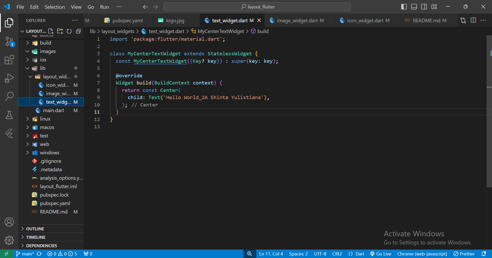
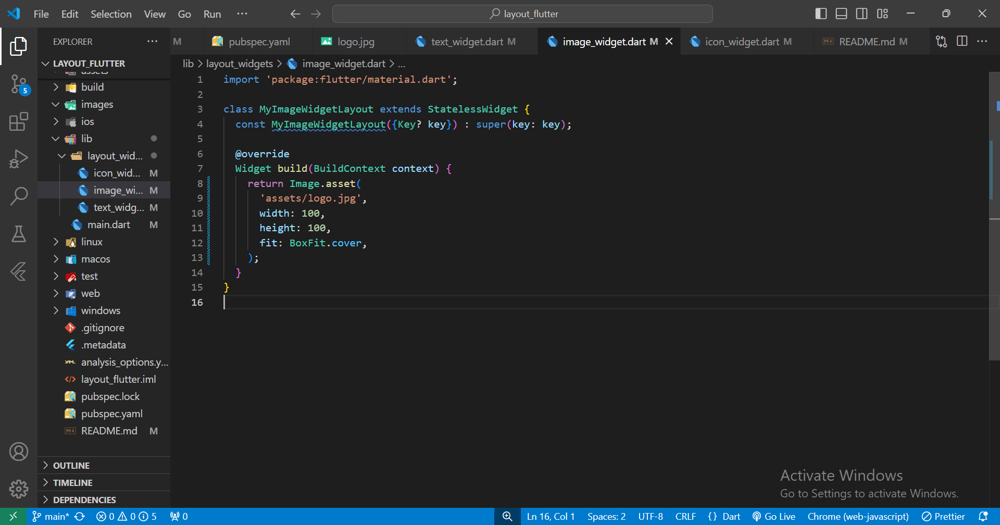
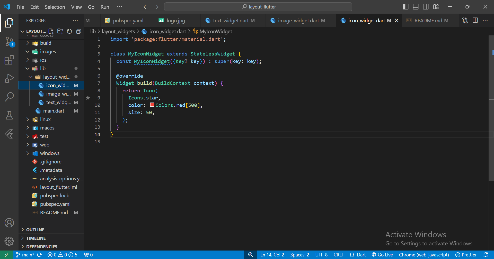
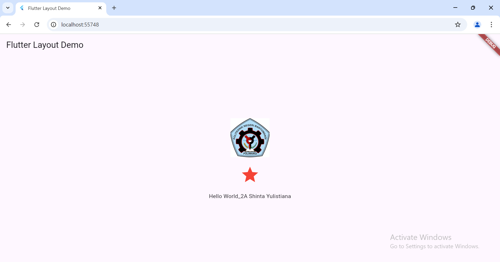

# layout_flutter

A new Flutter project.

Buat folder baru di lib yaitu layout_widgets lalu didalamnya buat file text_widget.dart lalu masukkan kode di bawah ini.

Buat juga file image_widget.dart di folder layout_widgets lalu masukkan kode di bawah ini.

Buat juga file icon_widget.dart di folder layout_widgets lalu masukkan kode di bawah ini.

Lalu sesuaikan pada file main.dart.

Berikut ini hasil akhirnya.

